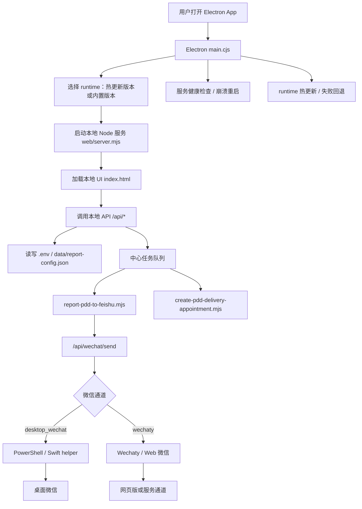
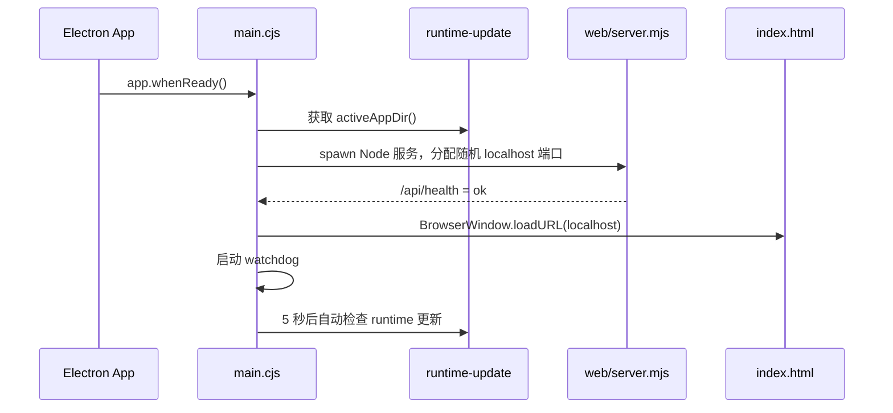
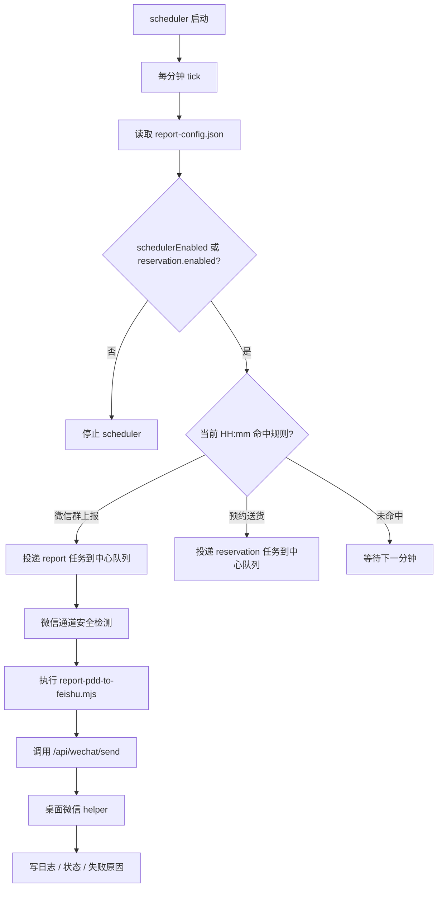
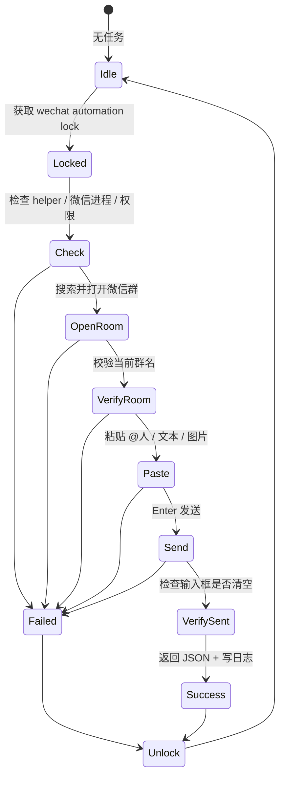
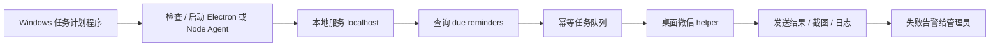

# 多多数字管家 Electron 架构说明

本文档用于说明当前 Electron App 的工作流和项目框架，方便后续复刻、迁移到用户 Windows 电脑，以及替换具体业务场景。

核心原则：

- Electron 只做桌面壳、权限桥、服务守护和热更新。
- 本地 Node 服务承载业务 API、配置、状态、调度和任务队列。
- Windows 桌面微信 helper 只负责最后一步：打开群、粘贴内容、发送、校验。
- 用户数据、配置、日志放在用户目录，安装包升级和 runtime 热更新不覆盖用户数据。

## 项目框架

```text
desktop/
  src/main.cjs
    Electron 主进程：启动本地服务、窗口加载、IPC、watchdog、热更新、桌面微信 helper 调用。

  src/preload.cjs
    通过 contextBridge 暴露安全桌面 API 给前端页面。

  src/runtime-update.cjs
    runtime 热更新：检查、下载、校验、切换版本、失败回退。

  native/windows/wechat-automation.ps1
    Windows 桌面微信自动化 helper：查找微信、搜索群、校验群名、粘贴、发送、写日志。

  native/macos/wechat-automation.swift
    macOS 桌面微信自动化 helper。

web/
  server.mjs
    本地 HTTP 服务：配置、状态、看板、同步、定时、任务队列、微信发送 API。

  index.html
    Electron 内加载的主 UI。

  kanban.html
    看板页面。

scripts/
  report-pdd-to-feishu.mjs
    上报业务脚本。

  create-pdd-delivery-appointment.mjs
    预约送货业务脚本。

  wechat-desktop-automation.mjs
    Node 包装层，调用平台原生微信 helper。

pdd-automation/
  PDD 登录态、采集、预约送货相关逻辑。

data/
  report-config.json
    上报规则、微信群规则、定时时间、心跳配置。
```

## 总体架构



## 启动工作流



启动时的关键动作：

- 创建用户 workspace 目录。
- 复制或读取 workspace 下的 `.env`。
- 找到当前 active runtime。
- 启动 `web/server.mjs`。
- 轮询 `/api/health`，成功后加载本地页面。
- 启动服务 watchdog，服务异常时尝试重启。
- 如果热更新 runtime 启动失败，回退到安装包内置 runtime。

## 定时上报工作流

当前实现里，定时器在 `web/server.mjs` 内部运行。开启 `schedulerEnabled` 后，服务每分钟检查一次规则。



当前定时规则来自：

```text
data/report-config.json
```

核心字段：

```text
schedulerEnabled
items[].sendTimes
items[].wechatEnabled
items[].wechatRoomName
reservation.enabled
reservation.firstRunTimes
reservation.lastRunTimes
heartbeat.enabled
heartbeat.intervalMinutes
```

## 桌面微信发送工作流

桌面微信通道用于绕开 Web 微信登录态不稳定的问题。Windows 用户电脑上推荐固定使用：

```env
MAO_WECHAT_CHANNEL=desktop_wechat
MAO_USE_DESKTOP_WECHAT=true
```



Windows helper 的职责边界：

- 查找或启动桌面微信。
- 将微信窗口置前。
- 搜索目标群。
- 用窗口标题和 UIAutomation 文本校验群名。
- 使用剪贴板粘贴文本、@人、图片。
- 发送后检查输入框是否清空。
- 输出 JSON，并写入 `wechat-desktop-automation-YYYY-MM-DD.log`。

helper 不负责：

- 业务规则判断。
- 定时调度。
- 模板生成。
- 重试策略。
- 用户配置保存。

这些都应该留在 Node 服务或任务队列里。

## 状态模型

```text
App 状态：
idle / starting / healthy / restarting / failed

任务队列状态：
idle / pending / running / completed / failed / timeout

Scheduler 状态：
stopped / running / skipped / error

微信通道状态：
unknown / checking / ready / failed / locked

发送状态：
draft / sent / verify_failed / helper_timeout / room_not_found
```

对应主要 API：

```text
GET  /api/health
GET  /api/status
POST /api/preflight
GET  /api/report-config
POST /api/report-config
POST /api/report-scheduler
POST /api/report
POST /api/wechat/send
GET  /api/desktop-wechat-smoke
POST /api/desktop-wechat-smoke
GET  /api/desktop-wechat-logs
```

## 当前实现状态

| 模块 | 状态 | 说明 |
|---|---|---|
| Electron 壳 | 已实现 | 启动本地服务、打开 UI、watchdog、热更新 |
| 本地 Node 服务 | 已实现 | API、配置、状态、任务队列、scheduler |
| 内置 scheduler | 已实现 | App 运行时每分钟检查 |
| Windows 桌面微信 helper | 已实现 | PowerShell + Win32/UIAutomation |
| macOS 桌面微信 helper | 已实现 | Swift helper |
| Wechaty / Web 微信 | 保留 | 状态稳定性较差，不建议作为 Windows 主通道 |
| Windows 任务计划程序 | 建议增强 | 用系统计划任务拉起/保活，更适合 24h 用户电脑 |

## 推荐迁移形态

用户是 Windows 电脑、可 24 小时开机时，推荐将“定时节拍”交给 Windows 任务计划程序，把 Node 服务变成可被唤醒和检查的本地执行器。



推荐拆分：

```text
Windows 任务计划程序：
  每 1 分钟触发一次。
  负责拉起或调用轻量检查脚本。

Node 本地服务：
  管理配置、任务、模板、幂等、日志、状态。
  提供 due-task API 或 CLI。

桌面微信 helper：
  只负责发送动作。
  不持有业务状态。
```

建议任务计划程序设置：

```text
触发器：
  每 1 分钟重复。

运行方式：
  Run only when user is logged on。

并发策略：
  如果任务已在运行，则不启动新实例。

系统设置：
  禁止睡眠。
  允许断电后恢复。
  桌面微信保持登录。
```

注意：桌面微信自动化必须运行在已登录的交互式桌面 session 中。不要使用“无论用户是否登录都运行”，否则 UI 自动化通常无法操作微信窗口。

## 可复刻原则

1. Electron 是壳，不放核心业务状态。
2. Node 服务是业务中心，管理配置、状态和任务队列。
3. 原生 helper 是窄接口，只做平台相关操作。
4. 微信发送前必须做群名校验。
5. 每条发送任务必须有幂等 key，防止重复发送。
6. 每次发送必须写日志，失败时保留可诊断信息。
7. Web 微信只作为备选通道，Windows 主方案使用桌面微信。
8. 用户电脑 24 小时运行时，优先使用 Windows 任务计划程序做节拍。
9. runtime 热更新只更新业务代码；Electron 壳、原生依赖和预加载 API 变化时发完整安装包。

## 一句话总结

当前项目已经具备可迁移骨架：

```text
Electron 壳 + 本地 Node 服务 + 任务队列 + Windows 桌面微信 helper
```

后续最值得增强的是：

```text
把内置 scheduler 扩展为可被 Windows 任务计划程序驱动的 due-task 执行器。
```

这样能降低对长驻 Node timer 的依赖，更适合 300 元/月以内、用户自有 Windows 电脑 24 小时开机的轻量微信群提醒场景。
